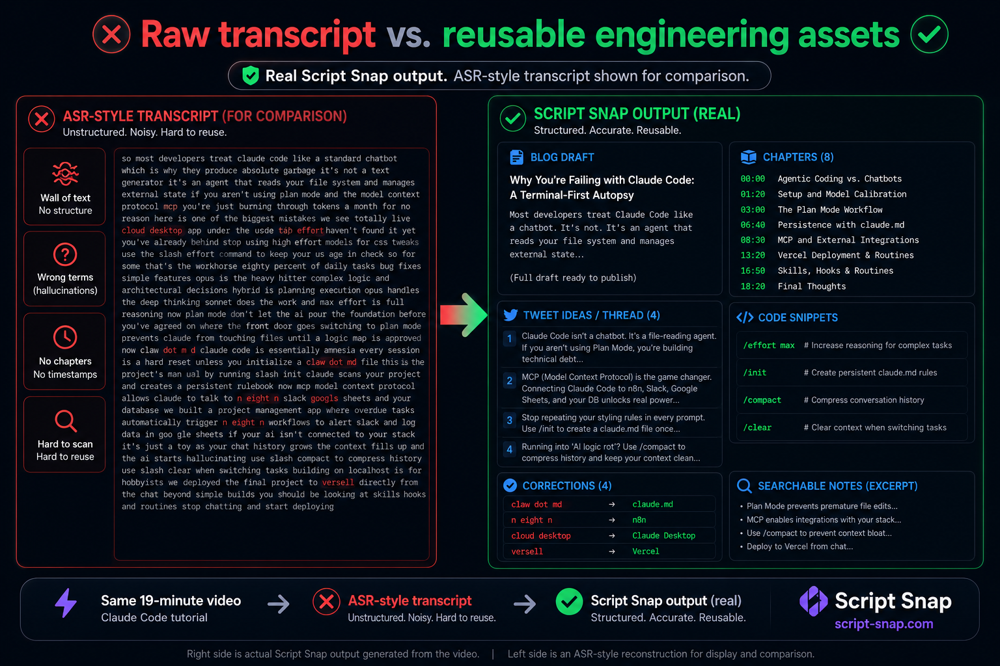

# script-snap-proof

Proof page: representative examples of Script Snap output from real technical videos.

## The Problem

Auto-generated transcripts mispronounce, merge, and hallucinate technical terms.

"claw dot m d" instead of `claude.md`. "cloud code" instead of Claude Code. "wasmon" instead of WozMon.

These errors break setup guides, code references, and any documentation that depends on accuracy.

## Before / After

Same video, same transcript line. Three tools, different results.

| Raw Transcript | Script Snap Output |
|---|---|
| "claw dot m d" | `claude.md` |
| "cloud code" | Claude Code |
| "model context protocol" | MCP |
| "n eight n" | n8n |
| "versell" | Vercel |
| "wasmon" | WozMon |



## Example 1: Ben Eater — Building a 6502 Computer

**Input:** ~2hr YouTube tutorial (hardware build, assembly language, vintage computing)

**Output:**
- Blog post with technical accuracy preserved
- Timestamped chapters (00:00 – 13:20)
- 5 code snippets extracted and formatted
- 8 terminology corrections verified

**Corrections include:**

| Transcript Said | Should Be | Context |
|---|---|---|
| wasmon | WozMon | Steve Wozniak's Apple I system monitor |
| Brentwood computer | breadboard computer | Electronics hardware setup |
| dot org | `.org` | Assembler origin directive |
| c c sixty five | `cc65` | C compiler suite for 6502 |
| l d sixty five | `ld65` | Linker tool for cc65 toolchain |

This video has dense, domain-specific vocabulary. Generic transcription tools produced multiple errors per paragraph. Script Snap caught and corrected them.

## Example 2: Claude Code Tutorial — Beginner to Advanced in 20 Minutes

**Input:** ~19min YouTube tutorial (AI coding workflow)

**Output:**
- Blog post: "Why You're Failing with Claude Code: A Terminal-First Autopsy"
- 4 tweet drafts
- 8 timestamped chapters
- 5 code snippets
- 4 terminology corrections

**Corrections:**

| Transcript Said | Should Be | Context |
|---|---|---|
| claw dot m d | `claude.md` | Persistent rules configuration file |
| n eight n | `n8n` | Workflow automation platform |
| cloud desktop | Claude Desktop | Anthropic's desktop client |
| versell | Vercel | Deployment hosting platform |

## What Script Snap Produces

From a single video, Script Snap generates:

- **Article draft** — long-form blog post with technical accuracy
- **Code snippets** — extracted and formatted for copy-paste
- **Timestamped chapters** — navigable video structure
- **Setup/spec outline** — actionable configuration steps
- **Terminology corrections** — domain-aware fixes that generic tools miss

## What This Is

A public proof page. Representative examples from real processed videos.

The goal is to show what Script Snap actually produces — no simulated results, no curated demos.

## What This Is Not

- Not a product page. No pricing. No waitlist. No sales Call-to-Action.
- Not a competitor comparison. No tool rankings or claims of market superiority.
- Not a guarantee. We do not claim perfect accuracy or hallucination-free output.

Script Snap is a tool for extracting structured content from technical videos. It works well on domain-specific vocabulary. It is not perfect. The examples on this page are real outputs, representative of actual processing.

## Output Formats

The same video produces multiple reusable assets:

```
2hr YouTube tutorial
  → Blog post (long-form, technically accurate)
  → Chapter timestamps (navigable)
  → Code snippets (copy-paste ready)
  → Tweet drafts (shareable)
  → Terminology corrections (domain-specific fixes)
```

Capture once. Reuse everywhere.

---

Built by [Script Snap](https://scriptsnap.com?ref=github-proof) — technical video → engineering assets.
